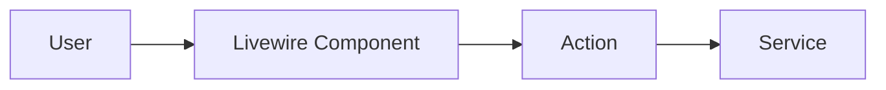

# Feature Specification Brainstorming

Start a collaborative brainstorming session for the feature: **$ARGUMENTS**

## Core Principle: Complete Specifications

**Every requirement must be explicit and verifiable.** Use checkboxes for ALL requirements so completion can be objectively measured. Ambiguity leads to incomplete implementations.

## Instructions

### 1. Create Q&A File

Create the questions file at: `specs/YYYY-MM-DD_{{feature_name}}-questions.md` (use today's date and the feature name from
arguments, use underscores for spaces).

### 2. Initialize the Conversation

Start the Q&A file with this header:

```markdown
# {{Feature Name}} - Q&A Session

**Date:** YYYY-MM-DD
**Status:** Brainstorming

---
```

### 3. Begin with Vision Question

Write the first message asking about the general vision:

```markdown
---

## Message 1: Understanding Your Vision

### The Feature

**My Current Understanding:**
[Brief summary of what you think this feature might be about based on the name]

**Questions:**
1. What problem does this feature solve?
2. Who will use this feature?
3. What does success look like?

**Fabian's Comment:**

---
```

### 4. Conversation Flow

For each subsequent message, follow this structure:

```markdown
---

## Message N: [Topic]

### [Sub-topic 1]

**My Current Understanding:**
[What you understand so far about this aspect]

**Questions:** (if needed)
- Question 1?
- Question 2?

**Recommendation:** (if applicable)
[Your recommendation with brief reasoning]

**Fabian's Comment:**

---

### [Sub-topic 2]
...
```

### 5. Use Diagrams

When helpful, include ASCII diagrams or Mermaid diagrams to visualize:
- Data flow
- Component relationships
- User journeys
- Database schemas

Example:
```markdown
**Architecture Concept:**

```

### 6. Decision Tracking

Once a decision is made on a topic, update the Q&A file by adding a "Decisions Summary" section after the header (if not present):

```markdown
## Decisions Summary

| Topic | Decision |
|-------|----------|
| **Topic Name** | Brief decision statement |
```

### 7. Follow-up Questions

When you need input on specific choices, format questions like this:

```markdown
---

### Q1: [Topic Name]

[Brief context for the question]

- [ ] **A) Option 1** - Description
- [ ] **B) Option 2** - Description
- [ ] **C) Option 3** - Description

**Recommendation:** [Your recommendation]

**Fabian's Comment:**
```

### 8. Session Rules

- **Always append to the file** - Never delete previous conversation
- **Mark user comments inline** - When Fabian adds comments, they stay in the "Fabian's Comment:" sections
- **Update status** as the spec progresses: `Brainstorming` → `In Discussion` → `Decisions Pending` → `Ready for Specification`
- **Read the full Q&A file** before each response to maintain context
- **Ask one thing at a time** - Don't overwhelm with too many questions

### 9. Wrapping Up Q&A

When all questions are answered, update the status to `Ready for Specification` and inform the user that you will now create the technical specification.

### 10. Generate Technical Specification

**CRITICAL STEP: This step persists ALL knowledge from the Q&A session into a detailed technical document that can be used by any agent in any conversation.**

Create the technical specification at: `specs/YYYY-MM-DD_{{feature_name}}-specification.md`

The specification MUST contain the following sections with COMPLETE details.

**CRITICAL FORMAT RULES:**

1. **ALL requirements MUST use checkboxes** - Every single item that needs implementation gets a `- [ ]` checkbox
2. **Requirements must be atomic** - One checkbox = one verifiable action
3. **No ambiguous language** - Replace "should", "might", "could" with "must" or remove
4. **Include file paths** - Every implementation item should specify the file to create/modify
5. **Group into phases** - Each phase becomes one iteration during development

```markdown
# {{Feature Name}} - Technical Specification

**Date:** YYYY-MM-DD
**Status:** Ready for Implementation
**Q&A Reference:** specs/YYYY-MM-DD_{{feature_name}}-questions.md

---

## 1. Overview

### 1.1 Feature Summary
[2-3 sentence description of what this feature does]

### 1.2 Business Value
[Why this feature matters, what problem it solves]

### 1.3 Target Users
[Who will use this feature and how]

---

## 2. Requirements

### 2.1 Functional Requirements
- [ ] FR-1: [Requirement description]
- [ ] FR-2: [Requirement description]
- ...

### 2.2 Non-Functional Requirements
- [ ] NFR-1: [Performance/Security/Scalability requirement]
- ...

### 2.3 Out of Scope
- [What this feature explicitly does NOT include]

---

## 3. Architecture

### 3.1 Component Overview
[Diagram and description of components involved]

### 3.2 Data Flow
[Step-by-step data flow through the system]

### 3.3 Dependencies
[External services, packages, existing components needed]

---

## 4. Database Schema

### 4.1 New Tables
[For each new table:]
```sql
CREATE TABLE table_name (
    -- columns with types and constraints
);
```

### 4.2 Table Modifications
[For each modified table:]
- Table: `table_name`
- Add column: `column_name` (type) - [reason]
- ...

### 4.3 Relationships
[Describe all relationships between models]

### 4.4 Indexes
[Any indexes needed for performance]

---

## 5. Implementation Steps

**CRITICAL: Each phase = one development iteration. User invokes `/dev {spec} continue` for each phase.**

### 5.1 Phase 1: [Phase Name]
**Iteration scope:** [Brief description of what this phase delivers]

#### Requirements (ALL must be checked off to complete this phase):
- [ ] **REQ-1.1:** Create migration `database/migrations/YYYY_MM_DD_create_X_table.php`
- [ ] **REQ-1.2:** Create model `app/Models/X.php` with relationships to Y, Z
- [ ] **REQ-1.3:** Create factory `database/factories/XFactory.php` with states: default, active, archived
- [ ] **REQ-1.4:** Create action `app/Actions/Domain/DoSomething.php` that [specific behavior]
- [ ] **REQ-1.5:** Write test `tests/Feature/Actions/Domain/DoSomethingTest.php` covering: [list scenarios]

#### Implementation Notes:
```php
// Key code snippets or patterns to follow
```

### 5.2 Phase 2: [Phase Name]
**Iteration scope:** [Brief description]

#### Requirements:
- [ ] **REQ-2.1:** [Specific requirement with file path]
- [ ] **REQ-2.2:** [Specific requirement with file path]

### 5.3 Phase N: [Final Phase - Integration & Testing]
**Iteration scope:** Final integration and comprehensive testing

#### Requirements:
- [ ] **REQ-N.1:** All tests pass (`php artisan test --parallel`)
- [ ] **REQ-N.2:** Code style validated (`vendor/bin/pint --dirty`)
- [ ] **REQ-N.3:** JetBrains MCP validation passed on all new/modified files
- [ ] **REQ-N.4:** Manual testing completed via Playwright

---

## 6. API / Interface Design

### 6.1 Routes
| Method | Route | Controller/Action | Description |
|--------|-------|-------------------|-------------|
| GET | /path | Controller@method | Description |

### 6.2 Livewire Components
| Component | Purpose | Key Properties | Key Methods |
|-----------|---------|----------------|-------------|
| ComponentName | What it does | $props | methods() |

### 6.3 Actions/Services
| Class | Purpose | Input | Output |
|-------|---------|-------|--------|
| ActionName | What it does | Parameters | Return type |

---

## 7. UI/UX Specification

### 7.1 Page/Component Layout
[ASCII diagram or description of layout]

### 7.2 User Interactions
1. User does X → System responds with Y
2. ...

### 7.3 States and Transitions
- Empty state: [description]
- Loading state: [description]
- Error state: [description]
- Success state: [description]

### 7.4 daisyUI Components to Use
- [component] for [purpose]
- ...

---

## 8. Testing Strategy

### 8.1 Unit Tests
| Test File | Test Cases |
|-----------|------------|
| `tests/Unit/...` | - test case 1 |
|                  | - test case 2 |

### 8.2 Feature Tests
| Test File | Test Cases |
|-----------|------------|
| `tests/Feature/...` | - test case 1 |
|                     | - test case 2 |

### 8.3 Critical Test Scenarios
1. **Happy Path:** [Description]
2. **Edge Case:** [Description]
3. **Error Case:** [Description]

### 8.4 Test Data Requirements
[Factories, seeders, or specific data needed]

---

## 9. Architecture Guidelines

### 9.1 Code Location
- Models: `app/Models/`
- Actions: `app/Actions/{Domain}/`
- Flows: `app/Flows/`
- Livewire: `app/Livewire/{Domain}/`
- Views: `resources/views/livewire/{domain}/`

### 9.2 Naming Conventions
- [Specific naming patterns for this feature]

### 9.3 Patterns to Follow
- [Reference existing similar implementations]
- [Specific patterns required]

### 9.4 Code Quality Rules
- [Any specific rules from CLAUDE.md that apply]

---

## 10. Validation & Completion Checklist

### Per-Phase Completion (checked by dev/tree commands):
- [ ] All phase requirements implemented (checkboxes in Section 5)
- [ ] Architecture-guardian review passed
- [ ] Implementation-completeness-reviewer passed for phase
- [ ] Git commit created for phase

### Final Completion (checked by /verify-complete command):
- [ ] ALL phases completed
- [ ] All tests pass (`php artisan test --parallel`)
- [ ] Code style validated (`vendor/bin/pint --dirty`)
- [ ] JetBrains MCP validation passed
- [ ] Manual testing via Playwright completed
- [ ] No gaps in -gaps.md file (or all addressed)

---

## 11. Notes & Decisions Log

[Copy all key decisions from the Q&A session here with context]

| Decision | Rationale | Date |
|----------|-----------|------|
| Decision 1 | Why this was chosen | YYYY-MM-DD |

---

## 12. Open Questions / Future Considerations

[Any items identified but deferred for later]
```

### 11. Critical Specification Review (Sub-Agent Validation)

**MANDATORY:** After generating the specification, launch a fresh sub-agent to validate it.

Use the Task tool with `subagent_type=general-purpose` and the following prompt:

```
You are reviewing a technical specification for completeness and consistency.

Read these files:
1. Questions document: specs/YYYY-MM-DD_{{feature_name}}-questions.md
2. Specification document: specs/YYYY-MM-DD_{{feature_name}}-specification.md

Verify:
1. NO logical inconsistencies or gaps between Q&A decisions and specification
2. ALL details discussed in Q&A are covered in the specification
3. Implementation is technically feasible
4. NO unnecessary tasks added that weren't mentioned in Q&A (scope creep)
5. ALL requirements use checkbox format (- [ ])
6. Requirements are atomic (one action per checkbox)
7. Each requirement specifies a file path
8. Phases are clearly separated for iterative development

Return ONE of:
- "READY TO GO" - Specification is complete and accurate
- "GAPS FOUND" - List specific issues that must be fixed

If GAPS FOUND, provide a numbered list of specific fixes required.
```

**Based on sub-agent response:**
- If "READY TO GO" → Proceed to user review
- If "GAPS FOUND" → Fix issues in specification and run validation again with a FRESH agent
- If fundamental problems → Delete specification, add clarifying questions to Q&A file, wait for user input

### 12. Final User Review

After sub-agent validation passes:

1. Present the specification to the user for review
2. Make any corrections requested
3. Update status to `Approved` when confirmed
4. Inform the user:

> "The technical specification is complete. To implement:
> - Use `/dev specs/YYYY-MM-DD_{{feature_name}}-specification.md` for each phase
> - After each phase, invoke `/dev {spec} continue` to proceed
> - When all phases complete, use `/verify-complete {spec}` for final validation"

---

Now create the Q&A file and begin the brainstorming session by asking about the vision for: **$ARGUMENTS**
